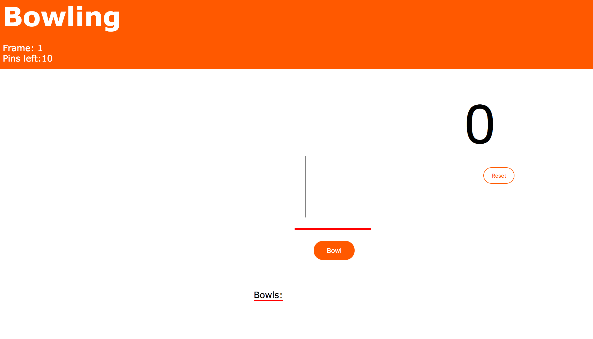
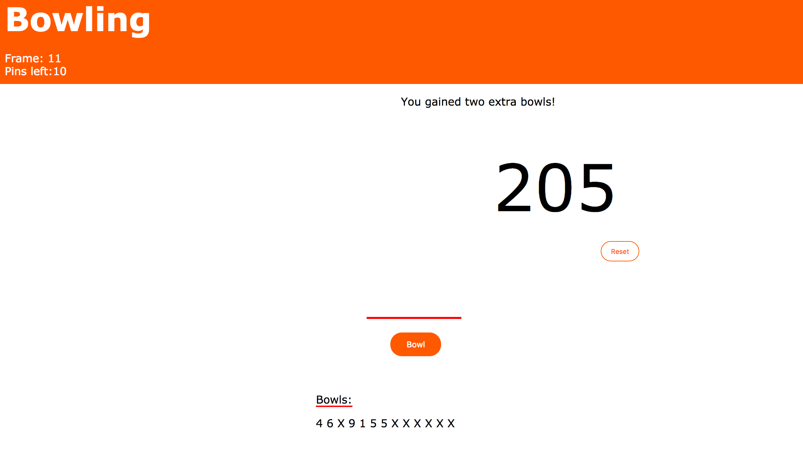
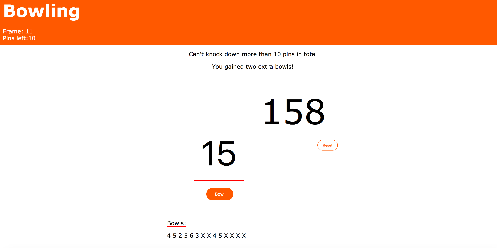

Bowling application
==================

Introduction
-------
The bowling application is the fifth weekend challenge at the Makers Academy in London. The challenge was to build an application where a user could input his/her scores from a 1 player 10 pin bowling game. The challenge was to build the application entirely in javascript for the game engine and implement jquery for the frontend solutions. I have built the application in a test driven approach using Jasmine. I have focused on making the user experience as easy and enjoyable as possible when inputting scores while keeping high validation in place. The game engine is true to the original game and handles edge case such as multiple strikes in row and extra frames after 10th frame.

Features that needed to be implemented:
-------

```
As a Player
So that I score my bowling scores
I want to sign input my score

As a Player
So that keep track of my overall score
I want the application to add my scores

As a Player
So that I can score my spares
I want the application to add extra pins from spares

As a Player
So that I can score my strikes
I want the application to add extra pins from my strikes

As a Player
So that I can play extra frames
I want to the application to know if I am awarded extra frames

As a Player
So that I don't input the wrong pin number
I want the application to validate the player input
```

Installation
-----
* Download the project folder.


How to use the applicaton
-----

To run the program start run the index.html file in your favourite browser. Browser needs to support jquery in order to make the application work.

Example
-----

Starting up the game and entering those strikes!



Checking the score and gaining extra frames.


Taking care edge cases when entering in scores.




Technologies used
-----
* Html
* Javascript
* Jquery
* Jasmine

Areas to improve
-----

* Data persistence
* Multiplayer game
* Improving the design features with added graphics.
